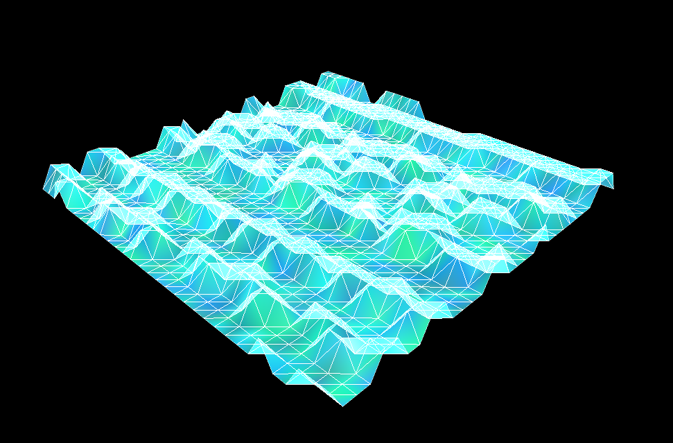

# Audioflexica
Audioflexica audio detection project for [Codeology](https://www.codeology.club/) Fall 2018

This was a 4-week project led by [Kevin Wang](https://www.linkedin.com/in/kevin-wang-ba7b36123/). The goal was to create a python program that detects sound from the computer's microphone and react to the sound via a 3D mesh. This was written in Python 2.7 and we used Anaconda Navigator to create a virtual environment and organize packages.

## Setup
After creating a conda environment by either using Anaconda Navigator or by running
`conda create -n yourenvname python=2.7 anaconda`
In your environment, run:
- conda install -c anaconda numpy
- pip install opensimplex
- conda install -c anaconda pyopengl
- conda install -c anaconda pyqtgraph
- conda install -c anaconda pyaudio

## Running the Program
Activate your conda environment. Then navigate to the folder containing audioflexica.py and run
`python audioflexica.py`
after installing all the necessary libraries.

## Example
Example of the mesh picking up background noise from the mic

## Issues
The main issue is that many of our laptop mics are sensitive enough to pick up a lot of background noise. Currently the program doesn't do a good job at differentiating between background noise and foreground noise. A future improvement would be to either have the program filter out background noise, or to create a GUI where the use can upload a .mp3 or .wav file for the program to read off of.